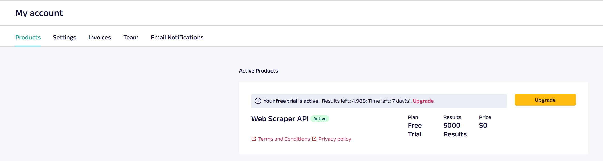
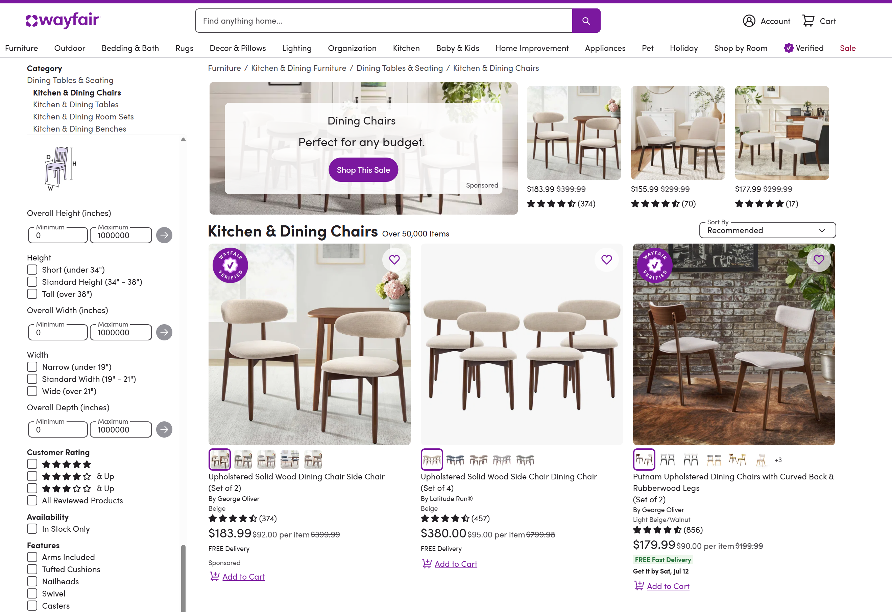

# How to Scrape Product Data From Wayfair

这个仓库fork自[这里](https://github.com/oxylabs/how-to-scrape-wayfair)，若欲学习详细请移步。

This repo is forked from this [source](https://github.com/oxylabs/how-to-scrape-wayfair), please refer to it to learn the details.

这个fork主要是为了爬取Wayfair的某商品搜索信息，将爬取的搜索结果保存至本地并输出搜索的具体信息，包括商品名，当前价格，原价，评分，评价数，商品链接和商品图片链接。

This fork is intended to scrape the search result of Wayfair. It saves the search result to local and gives the name, current_price, original_price, rating, review_count, product_url and image_url.

## Preparation

在[Oxylabs](https://oxylabs.io/)注册账号，这个网站提供了API，用作爬取Wayfair的代理，以防被Wayfair反爬虫。
网站提供了7天内5000条爬取记录的免费试用，可以用这个试用额度测试爬取结果。

### Sign up and purchase free plan

注册Oxylabs网站后，在这个[页面](https://dashboard.oxylabs.io/en/overview/My%20account/Products)购买免费的Web Scraper API。


### Setup Web Scraper API

购买成功后，会要求填写API的名称和密码，请记住密码。API名称后续可以在[这里](https://dashboard.oxylabs.io/en/overview/scraper/users)查阅。

## Installation

### Clone this repo

克隆本项目到本地，需要本地安装好[git](https://git-scm.com/)。

`git clone https://github.com/0x11111111/how-to-scrape-wayfair`

或者直接下载好项目的[压缩包](https://github.com/0x11111111/how-to-scrape-wayfair/archive/refs/heads/main.zip)并解压。

### Install dependencies

假设你已经安装好Python(3.11以上)并将其加入了系统Path。在命令行执行以下：

`pip install requests beautifulsoup4 pandas`

## Data Scraping

* 随后在info.json中username和password填入上述过程得到的**Oxylabs**的账号密码，注意**不是Wayfair**的。本项目是通过Oxylabs的代理来绕过Wayfair的爬虫限制，从而抓取数据的。
    在Wayfair搜索后，地址栏连接就是需要爬取的连接，在info.json的product_url填入这个链接。

* 以这个椅子的搜索为例：
    
    其链接为https://www.wayfair.com/furniture/sb0/kitchen-dining-chairs-c46130.html，将其填写到info.json中product_url字段。

* 随后执行脚本

    `python src/wayfair_scraper.py`

* 等待一段时间后，如果输出如下信息则为爬取成功：

    ```log
    [INFO] Found 61 ListingCards, saving to ListingCards_20250708_133943
    [DONE] Data written to ListingCards_20250708_133943\cards_data.csv
    ```
* 脚本会在本地目录创建类似名称为`ListingCards_20250708_133943`这个文件夹，其中包含了三种内容：
  
  1. product_page_*_*.html | 这是抓取到是搜索页面的源码html，用于解析搜索结果。
  2. card_*.txt | 这是搜索页每个商品项目提取出来的细节，对应抓取到的html中的每个`ListingCard`，每个就是一个商品
  3. cards_data.csv | 汇总这个搜索结果，包括了商品名，当前价格，原价，评分，评价数，商品链接和商品图片链接。

## P.S.

因为采用了第三方代理搜索，其结果和网页搜索结果有出入，表现为商品名称、数量、顺序不同。但是都是可以在Wayfair上检索到同名商品的，信息也正确的。如果需要爬取更多搜索结果、更多的抓取条目，本项目仅仅是抛砖引玉，就不做展开了。

其他更复杂需求可以在本项目基础上做延伸修改，或者可以考虑使用Oxylabs的[Python-sdk](https://github.com/oxylabs/oxylabs-sdk-python)做更深入处理，他们包装了很多数据抓取的请求，可以实现更加方便的检索和爬取。

如果项目有问题，欢迎提出PR。

## Acknowledgement

Oxylabs为爬虫提供了一些不错的包装，可以省去一些反爬虫的麻烦。后续可以深入研究一下。
